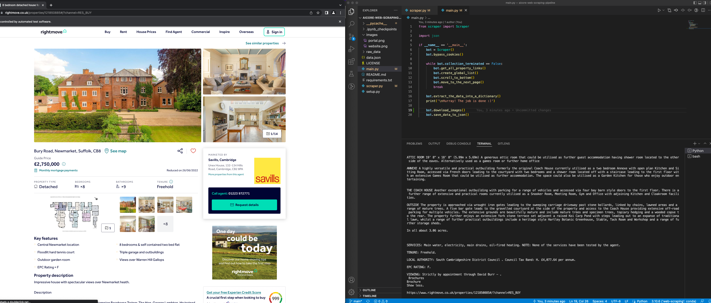
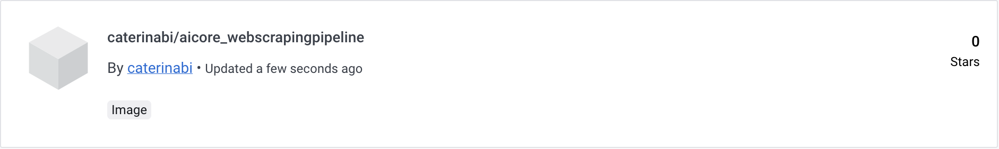

# Web scraping pipeline (AiCore training)

Web scraping pipeline I'm working on as part of my 'AI and data engineering' training at [AiCore](https://www.theaicore.com/?utm_source=google&utm_medium=cpc&utm_campaign=new-broad&utm_term=classification&utm_source=google&utm_medium=ppc&utm_campaign=UK-Brand&utm_term=ai%20core&utm_content=621263672281&hsa_acc=7296592433&hsa_cam=13050226730&hsa_grp=146850559851&hsa_ad=621263672281&hsa_src=g&hsa_tgt=kwd-453580118074&hsa_kw=ai%20core&hsa_mt=e&hsa_net=adwords&hsa_ver=3&gclid=Cj0KCQjwj7CZBhDHARIsAPPWv3cRHYGa6UYh2t0kFM_4r7C6QAXdB4IMha25Y77p7wcgt712S5vymj4aAq8xEALw_wcB). Despite me being quite confident coding in Python, this is my first ever webscraping experience, therefore all technologies and tools mentioned throughout are being learned from scratch, one at a time 🤯


## 🏅 Goals of the project 🏅

The requirements for this data collection pipeline are to:

- develop a module that scrapes data from various sources using Selenium and Requests;

- curate a database with information about the chosen website and store it on an AWS RDS database using SQLAlchemy and PostgreSQL;

- perform unit testing and integration testing on the application to ensure that the package published to Pypi works as expected;

- use Docker to containerise the application and deploy it to an EC2 instance;

- set up a CI/CD pipeline using GitHub Actions to push a new Docker image;

- monitor the container using Prometheus and create dashboards to visualise those metrics using Grafana.

## Language and tools

<p align="left"> <a href="https://www.python.org" target="_blank" rel="noreferrer">  </a> <a href="https://www.selenium.dev" target="_blank" rel="noreferrer">  </a> <a href="https://www.w3.org/html/" target="_blank" rel="noreferrer">  </a> <a href="https://git-scm.com/" target="_blank" rel="noreferrer">  </a> </p>

## Milestones 1-2: Environment setup and choice of website to scrape

The project is being completed using [VS Code](https://code.visualstudio.com/) as a code editor, plus Git and GitHub for version control. The environment setup was done by creating a new environment, `web-scraping`, in conda. Once every required package had been installed, a `requirements.txt` file was generated.

The choice of website to scrape was based on two main criteria: personal interest, and learning opportunities. Being a real estate enthusiast, my choice fell rather naturally on [RightMove](https://www.rightmove.co.uk/). Quite luckily, the website is challenging to scrape and offers plenty of opportunities to learn HTML tricks. Additionally, it stores data in rigorous fashion, thus making it a pleasure to scrape and create a database out of.

Given that the website includes thousands of properties for sale and rent located throughout the United Kingdom, I decided to reduce the scope of my project to only include properties for sale in a 10-mile radius from Cambridge, as shown in the image below.


## Milestone 3: Find links to the pages from which we wish to scrape data

The project is written in Python and utilises OOP concepts throughout. In this milestone, I created a `Scraper()` class within a `scraper.py` file and started to populate it with methods intended to create a list of the properties featured on the first page of my research, and then extract the links of each one of these and store them in a dedicated list. The `main.py` file, which runs the code, includes what follows:

```python
if __name__ == '__main__':
    bot = Scraper()
    bot.bypass_cookies()

    while bot.page <2: # use while True when scraping all pages
        bot.get_all_property_links()
        bot.create_global_list()
        bot.scroll_to_bottom()
        bot.move_to_the_next_page()
```

`if __name__ == '__main__':` assigns the scraper to the `bot` variable. First, the scraper bypasses cookies - `try-except` is used in the `bypass_cookies` to make sure the programme doesn't crash in the absence of cookies to accept. The scraper then performs all actions from the methods in `scraper.py`, until all properties in all web pages into consideration have been found. This is done using a while-loop.

The scraper includes a crawler. The first action performed by the scraper after accepting the cookies is indeed that of finding all properties on the page, and then all the links to said properties. These are stored in dedicated lists, and then added to a `all_properties_links` which is extended with all extracted elements (properties and their links) from all pages. The first property on the property list from each page is always a 'featured property' and is therefore systematically sliced out.

Once a page has been scraped, the scraper moves to the bottom of it and clicks on the 'next page' botton. `try-except` syntax is used to ensure that the programme doesn't crash when there is no more 'next page' button. The condition in the while-loop ensures that the code is only run and tested only on the first two pages for now.

Meaningful messages are printed throughout at this stage. Additionally, the program utilises numerous 
`time.sleep(2)` methods to make sure the website does not recognise it as a bot and blocks our IP address.
## Milestone 4: Retreive data from details page

In this milestone, I created a method called `extract_the_data_into_a_dictionary()` which loops through the `all_properties_links` list and creates dictionaries that map pre-determined keys (labels) to values extracted from a link. The dictionaries are then systematically appended to the end of the `properties_dict_list` list. The dictionaries have the structure thet follows:

```python
properties_dictionary = {'ID': , 'UUID': , 'Image': , 'Price': , 'Address': , 'Type': , 'Description': , 'Date scraped': , 'Time scraped': }
```

 The value associated to the 'Image' key here is the url associated to the property floorplan. The actual image is downloaded later in the class using a `download_image()` method that loops though the dictionaries for each property, names the images as 'date_time_image_imagenumber.jpg', and stores them locally.

At this point, the code still contains numerous prints and unnecessary comments, which will be stripped from it at refactoring, i.e., in the next milestone. Nonetheless, the code works in a satisfactory way and all required tasks are performed correctly, including the creation of a .json file to store all data retrieved by the scraper, whose entries look as follows:

```python
    {
        "ID": "property_2",
        "UUID": "f39dabfa-a164-499c-8ee8-c7dd2a54571f",
        "Image": "https://media.rightmove.co.uk/35k/34529/126708074/34529_CAM210328_IMG_00_0000.jpeg",
        "Price": "£6,500,000",
        "Address": "Adams Road, Cambridge",
        "Type": "Detached",
        "Description": "Property description\nA magnificent Victorian house with beautifully presented accommodation, set in stunning landscaped gardens, in an idyllic west city location.\n\nCambridge City Centre 1 mile, Mainline Railway Station 2 miles (Liverpool Street 70 minutes and King's Cross 49 minutes), M11 (Junction 13) 2.5 miles (distances and times are approximate).\n\nDating from 1899, No 7 Adams Road is a truly wonderful example of the late Victorian era and most imposing from its rear elevation, with charming reception rooms, original features still intact and a delightful aspect over the gardens to the south. Constructed of mellow red brick elevations with pretty tile hanging to the first floor under a tiled roof, of particular note is the superb first floor Library with its barrelled ceiling.\nMore recently the current owners have sympathetically extended and renovated the property under the direction of NRAP, a leading Cambridge practice to ensure the retention of many of the original period features including panelling, window seats and cornicing. Merging seamlessly with the original building, the new extension incorporates a large family kitchen/breakfast room with handmade units by Chalon of London, a splendid conservatory built by Vale Garden Houses leading through to the spa/gym with bespoke glass shower and sauna enclosures and an Italian spa designed by Tecu with Luna stone tiling. A new luxurious principal bedroom occupies the entirety of the first floor of the extension and completes this work.\n\n\nAdams Road is widely regarded as one of the best addresses in the city and is characterised by substantial houses in large gardens. Situated less than a mile west of the heart of the\nhistoric centre, the property occupies an idyllic position close to many of the College and University Departments and their playing fields, including St John's College School and King's College School which are just a short walk away in neighbouring Grange Road and West Road respectively. Cambridge also offers a wide range of educational and cultural amenities and is not only world renowned for its academic achievements, but also has become an important centre for the ‘high tech’ and ‘bio tech’ industries with the University Research and Development Laboratories and the internationally renowned Cambridge Science Park. Addenbrooke’s Hospital and the new Cambridge Biomedical Campus, planned to be one of the largest centres of health, science and medical research in the world, is within about 1.5 miles to the east. London commuters are well served with a mainline railway station about 2 miles away providing services to King’s Cross and Liverpool Street in about 52 and 67 minutes respectively and the M11 (junction 11) is about 2.5 miles away providing access to Stansted Airport and the M25.\nBrochures\nParticulars\nShow less",
        "Date scraped": "2022-11-02",
        "Time scraped": "11:21"
    }
```

Both the scraped images and the .json file are stored in a dedicated local directory called `raw_data`.



The most important takeaways of this milestone where the correct implementation of while loops (ouch!) and choice of relative xpaths to extract content from the page. I also learnt how to download images locally and to create a .json file from a list of dictionaries using the `json.dump()` method to store data locally.

## Milestone 5

The first part of milestone 5 was refactoring, i.e., a first scrutinisation of the scraper code. Accordingly:

- all unnecessary comments were removed;
- docstrings were added to all functions;
- method and variable names were changed when necessary to make them transparent;
- all code repetitions were discarded;
- longer methods were broken into smaller ones that only perform one task. Notably, the `extract_the_data_into_a_dictionary()` method now only creates the dictionary, without doing any scraping. The scraping part is now left to dedicated methods, nemely:

```python3
generate_property_ids() # id based on property number and unique uuid4
get_first_image_link()
get_property_metrics() # price and address
get_property_type()
.get_property_description()
```
- imports and from statements are in consistent alphabetical order;
- there are no nested loops within the code.

In the second part of this milestone, I created unit tests for my scraper using `unittest`, i.e., one test for each of the public methods of my `Scraper()` class. These are in the file `test_scraper.py` within the `tests` directory. They are run from `__main__.py`. While this was my first time performing unit testing, the process went quite smoothly and was not too time-consuming.

The best takeaway from this milestone was how to make my code a package to make sure all imports function throughout.

## Milestone 6

With the basic scraper code in `scraper.py` refactored and passing all tests, milestone 5 required to implement the lines of code needed to run the scraper in headless mode. This was done using `Options()` as follows:

```python3
options = Options()
        # options.headless = True
        options.add_argument("--disable-gpu")
        options.add_argument("--disable-extensions")
        options.add_argument("--disable-infobars")
        options.add_argument('--window-size=1920,1080')
        options.add_argument("--disable-notifications")
        options.add_argument('--headless')
        options.add_argument('--no-sandbox')
        options.add_argument('--disable-dev-shm-usage')
        self.driver = webdriver.Firefox(options=options)
        self.driver.get(url)
```

Note that I had to modify my code to run webdriver with FireFox instead of Chrome, as Macs with M1 chips do not support running chrome driver headless with Docker. 

The following task of this milestone was indeed the creation of a `Dockerfile` to build a scraper image locally. This required instructions to:

- choose a base image (in my case, `python:3.9`);
- put everything required by my scraper within the container;
- install all dependencies;
- run the main Python file.

The installation of FireFox required the following commands, which I copy hoping they'll come in handy to other learners:

```python3
# Update the system and install firefox
RUN apt-get update 
RUN apt -y upgrade 
RUN apt-get install -y firefox-esr

# get the latest release version of firefox 
RUN wget https://github.com/mozilla/geckodriver/releases/download/v0.32.0/geckodriver-v0.32.0-linux32.tar.gz \
    # extract the geckodriver
    && tar -xvzf geckodriver* \
    # add executable permissions to the driver
    && chmod +x geckodriver \
    # Move gecko driver in the system path
    && mv geckodriver /usr/local/bin
```

Once built, the image was run to make sure it worked properly, and then pushed to the [DockerHub](https://hub.docker.com/) where it now sits proudly.



## Milestone 7

This milestone required the creation of two github secrets, `DOCKER_HUB_USERNAME` and `DOCKER_HUB_ACCESS_TOKEN`. These contain, respectively, my personal id from DockerHub and a [Personal Access Token](https://docs.docker.com/docker-hub/access-tokens/#create-an-access-token) created on DockerHub.