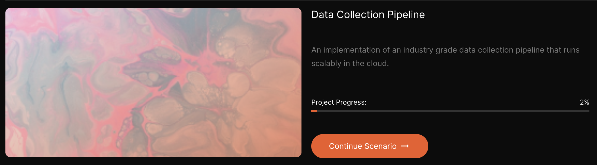
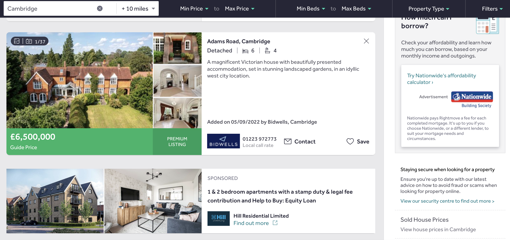

# Web scraping pipeline (AiCore training)

Web scraping pipeline I'm working on as part of my 'AI and data engineering' training at [AiCore](https://www.theaicore.com/?utm_source=google&utm_medium=cpc&utm_campaign=new-broad&utm_term=classification&utm_source=google&utm_medium=ppc&utm_campaign=UK-Brand&utm_term=ai%20core&utm_content=621263672281&hsa_acc=7296592433&hsa_cam=13050226730&hsa_grp=146850559851&hsa_ad=621263672281&hsa_src=g&hsa_tgt=kwd-453580118074&hsa_kw=ai%20core&hsa_mt=e&hsa_net=adwords&hsa_ver=3&gclid=Cj0KCQjwj7CZBhDHARIsAPPWv3cRHYGa6UYh2t0kFM_4r7C6QAXdB4IMha25Y77p7wcgt712S5vymj4aAq8xEALw_wcB). Despite me being quite confident coding in Python, this is my first ever webscraping experience, therefore all technologies and tools mentioned throughout are being learned from scratch, one at a time 🤯

### 🏅 Goals of the project 🏅

The requirements for this data collection pipeline are to:

- develop a module that scrapes data from various sources using Selenium and Requests;

- curate a database with information about the chosen website and store it on an AWS RDS database using SQLAlchemy and PostgreSQL;

- perform unit testing and integration testing on the application to ensure that the package published to Pypi works as expected;

- use Docker to containerise the application and deploy it to an EC2 instance;

- set up a CI/CD pipeline using GitHub Actions to push a new Docker image;

- monitor the container using Prometheus and create dashboards to visualise those metrics using Grafana.

### Language and tools

    

## Milestones 1-2: Environment setup and choice of website to scrape

## Milestone 3: Find links to the pages from which we wish to scrape data